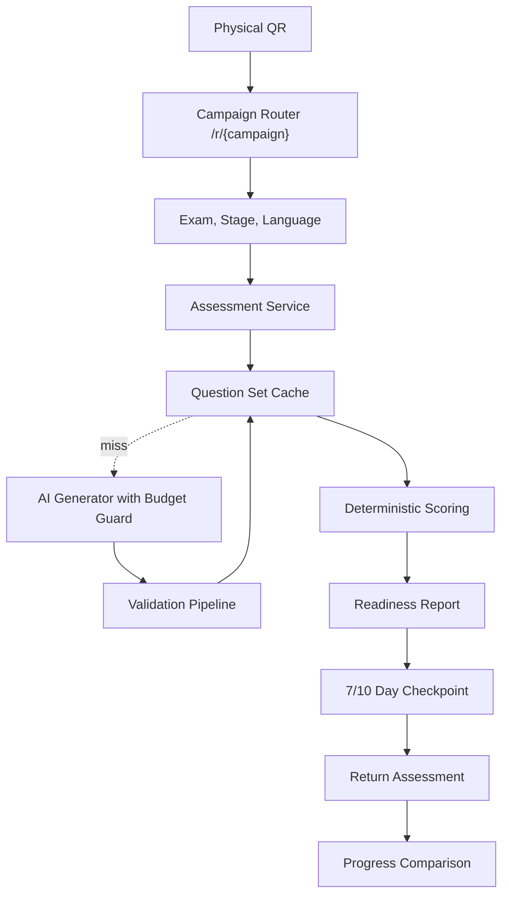
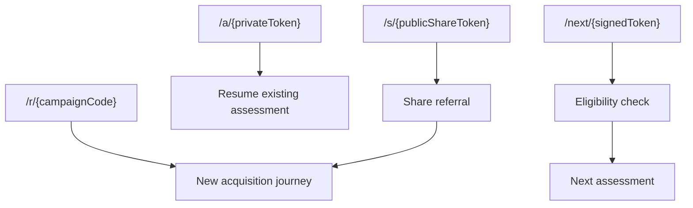
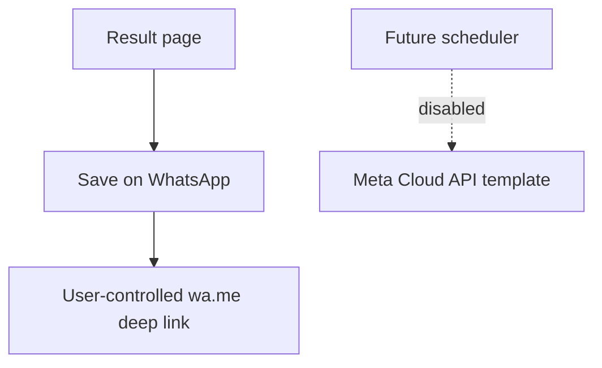
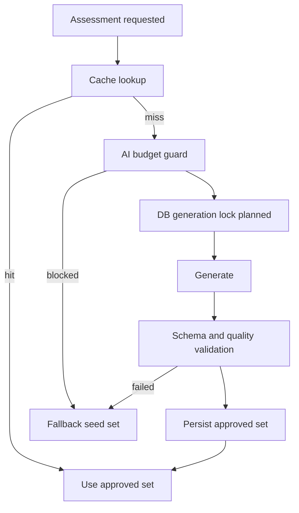
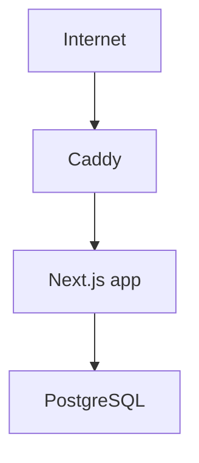

# Readiness Architecture

Readiness is a fixed-cost modular monolith for competitive-exam readiness diagnostics. The release-1 path is intentionally short: scan, choose exam, answer 10 questions, see a deterministic readiness snapshot, save a next checkpoint, and return for comparison.

## High-Level Flow

## Link Classes

Private assessment tokens are random opaque values stored only as hashes. A started assessment also requires a browser ownership cookie before answers or results can be modified.

## WhatsApp

Release 1 does not need Meta Business verification, templates, webhooks, or outbound WhatsApp automation.

## AI

AI generates reusable question sets, not per-student content.

The current implementation includes cache keys, validation, budget checks, AI usage records, and fallback behavior. A production AI provider adapter can be added behind the existing `LlmProvider` interface.

## Deployment

No autoscaling, no managed database, no Redis, no queue, and no third-party analytics are required.
